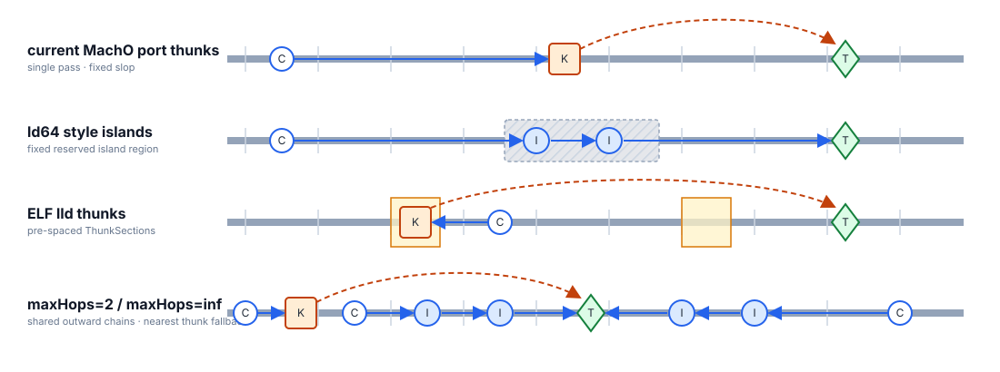

# RFC: Exact-Layout Branch Range Extension

## Summary

ARM64 direct branches have limited reach. When a destination is out of range in
the final linked image, lld redirects the branch through a
[range extender](#term-extender): either a 4-byte [island](#term-island) or a
12-byte [thunk](#term-thunk). For background, see @MaskRay's blog
[Long branches in compilers, assemblers, and linkers](https://maskray.me/blog/2026-01-25-long-branches-in-compilers-assemblers-and-linkers).

This RFC adds opt-in extension modes; the default
`--branch-range-extension=thunks` path is unchanged.

**Slop-free.** The existing one-pass finalizer reserves fixed *slop* for extenders
that may be inserted later, artificially reducing every branch's usable range.
The new algorithm replaces this slop with runtime reservations based on actual
extender demand, then rebuilds and validates the graph against its exact layout.

**Hybrid.** Extenders combine cheap islands with thunks.
`islands-slop-free` permits an unlimited island chain, while `hybrid` limits a
chain to two islands and uses thunks for the remaining calls.

## 1. Algorithm

### 1.1 Exact-layout iteration

The slop-free modes keep planning separate from committed output. Each pass
builds a fresh extender graph, calculates the layout containing only its live
extenders, and validates every `BRANCH26` edge. A rejected graph is rebuilt;
only a self-validating graph is materialized.

A rejection increases the reservation at boundaries whose demand grew or marks
newly invalid direct calls as requiring an extender. Both facts are monotonic
across passes. Iteration fails after 30 passes if no proposal validates. See
[validation and learning](#b1-validation-and-learning) for the corresponding
state updates.

### 1.2 Pseudocode

Reservation growth and call promotion are inline loops in `Finalizer::run`:

```cpp
for (pass = 1; pass <= 30; ++pass) {
  plan(); // reservation layout, then a fresh callee-centric extender graph
  walkLayout(LayoutKind::proposal); // exact layout with live extenders only
  if (validate())
    break;

  if (growBoundaryReservations())
    continue;
  forceInvalidDirectCalls();
}
if (pass > 30)
  fail();

materialize();
rewriteBranchesAndCollectStats();
walkLayout(LayoutKind::commit);
```

### 1.3 Callee-centric planning

Planning is coverage-driven rather than callsite-driven:

1. **Build a pessimistic coverage graph.** For each callee side, the furthest
   callsite defines the region extent. Against one reservation layout, emit an
   ordered island chain and enough thunk candidates to cover that region.
   Placement depends only on the callee, extent, policy, and reservation—not on
   which callsite is visited first.
2. **Route callsites.** Keep a call direct when it reaches the callee; otherwise
   binary-search the ordered candidates for a reachable forward extender on
   the lower side or backward extender on the upper side. This phase creates no
   extenders.
3. **Eliminate unused extenders.** Treat routed extenders as roots and retain
   their transitive callee-directed chains. An island remains live when an
   outward island uses it even if no callsite does; remove every other
   candidate.

### 1.4 Comparison

**Pass strategy:**

- `thunks`: single pass protected by fixed slop.
- ELF: multiple passes that mutate output until stable.
- `hybrid`: multiple passes that learn from and rebuild rejected proposals.

**Layout exactness:**

- ELF: materialized layout recalculated by `assignAddresses()`.
- `hybrid`: uncommitted proposal calculated manually by
  [`walkLayout()`](#b2-layout) and checked again at commit.

Here, `hybrid` also represents the shared exact-layout machinery used by
`islands-slop-free`.

The placement policies are illustrated below. Arrows show the first branch hop
and, for islands, subsequent range-limited hops toward the target.



**Placement preference:**

- `thunks`: place the active thunk near the forward edge of the waiting
  callsite's reach, maximizing distance from that callsite and reuse by later
  callsites.
- `islands`: place islands in the fixed reserved region rather than optimizing
  distance to an individual callsite or callee.
- ELF: prefer an existing pre-spaced `ThunkSection` within callsite reach; if
  none exists, place one immediately beside the callsite.
- `hybrid`: place each island as far from the callee toward the furthest
  callsite as its callee-directed hop permits; place a fallback thunk at the
  nearest legal boundary to the uncovered callsite.

## 2. Benchmark results

**Experiment setting.** We link two production binaries: AwemeLGCore with a
360 MiB `__text` and TikTokCore with a 420 MiB `__text`. Each binary is linked
in four modes: the existing lld `thunks`, the downstream fixed-reservation
`islands`, and the new exact-layout `islands-slop-free` and `hybrid` modes.
*Contribution* is the total emitted extender code: 4 bytes per island and 12
bytes per thunk.

| Mode | `x16` clobber | Slop-free | AwemeLGCore contribution | TikTokCore contribution |
|---|:---:|:---:|---:|---:|
| `thunks` | yes | no | 3.68 MiB | 6.82 MiB |
| `islands` | no | no | 1.83 MiB | 4.16 MiB |
| `islands-slop-free` | no | yes | 1.76 MiB | 3.32 MiB |
| `hybrid` | on fallback | yes | 1.76 MiB | 3.67 MiB |

The extender counts behind those contributions are:

| Mode | AwemeLGCore thunks | AwemeLGCore islands | TikTokCore thunks | TikTokCore islands |
|---|---:|---:|---:|---:|
| `thunks` | 321,574 | 0 | 596,310 | 0 |
| `islands` | 0 | 478,439 | 0 | 1,089,665 |
| `islands-slop-free` | 0 | 461,523 | 0 | 869,543 |
| `hybrid` | 0 | 461,523 | 59,371 | 783,688 |

Two island hops cover all AwemeLGCore call distances, so `hybrid` and
`islands-slop-free` produce exactly the same layout. TikTokCore calls beyond
two island hops account for hybrid's thunk tail.

### Linking Performance
TikTokCore:


### Runtime Performance
AwemeLGCore:

Launching Time:

Page-in Events:


TikTokCore:

Launching Time:

Page-in Events:


## 3. Current design

### 3.1 Data model

The implementation uses one in-place pointer graph:

| Structure | Main state |
|---|---|
| `Boundary` | input section, cross-pass `reserved`, per-pass `planned`, derived VA |
| `Callee` | canonical target and sorted callsites |
| `Callsite` | relocation, input boundary, monotonic `forceExtender`, selected extender |
| `Extender` | callee, boundary index, kind, liveness, VA, materialized section and symbol |

The helpers consume this graph as follows:

- `plan()` reads callee groups, `reserved`, and `forceExtender`, then rebuilds
  `planned`, callsite routes, and the live `Extender` graph.
- [`walkLayout()`](#b2-layout) reads the shared owners, boundaries, inputs, and
  current extenders, then updates their derived layout state.
  - `LayoutKind::reservation` lays out inputs with `Boundary::reserved` to
    provide planning VAs.
  - `LayoutKind::proposal` lays out inputs with live extenders and no
    reservation to provide exact validation VAs.
  - `LayoutKind::commit` lays out materialized extenders, finalizes the output,
    and checks emitted VAs against the proposal.
- [`validate()`](#b1-validation-and-learning) reads those VAs and callsite
  routes to accept or reject every `BRANCH26` edge.
- [`growBoundaryReservations()`](#b1-validation-and-learning) reads rejected
  per-boundary demand and monotonically raises `reserved`.
- [`forceInvalidDirectCalls()`](#b1-validation-and-learning) reads rejected
  direct routes and monotonically sets `forceExtender`.
- `materialize()` reads the accepted extender graph and creates each
  extender's input section and symbol.
- `rewriteBranchesAndCollectStats()` reads accepted callsite routes, retargets
  required relocations, and records their extender kinds.

## Appendix A: Terminology

<a id="term-extender"></a>

### Extender

An *extender* is linker-generated code that gives an out-of-range branch a
reachable intermediate destination. In this RFC, an extender is either an
island or a thunk.

<a id="term-island"></a>

### Island

An *island* is a 4-byte ARM64 direct branch inserted between a callsite and its
destination. Its outgoing edge is also range-limited, so islands may be
chained: a terminal island branches to the original destination, while a relay
island branches to another island closer to that destination.

<a id="term-thunk"></a>

### Thunk

A *thunk* is a 12-byte `adrp; add; br x16` sequence inserted within
direct-branch range of a callsite. Its branch to the original destination does
not use a range-limited `BRANCH26` relocation, so a thunk does not need an
island chain. It clobbers `x16`.

## Appendix B: Implementation reference

### B.1 Validation and learning

Every island must reach its next inward island or callee, every routed call must
reach its extender, and every remaining direct call must reach its callee.
Unresolved direct calls are accepted only for DTrace, and forced calls may not
remain direct.

After failure, reservations first grow to live planned bytes. Only when no
reservation grows are exact-layout direct failures marked `forceExtender`.

### B.2 Layout

Materialization creates islands from the target outward so each relay can refer
to an existing inward symbol, then creates thunks. Rewriting keeps a call direct
when the accepted exact layout permits it; otherwise it retargets the relocation
to the selected extender and clears the addend.

`walkLayout(LayoutKind::commit)` repeats the accepted proposal layout while
finalizing inputs and extenders, and asserts that their emitted VAs match the
proposal. Verbose statistics report passes, branch relocations,
island/chain/thunk calls, island and thunk counts, verified `BRANCH26` edges,
boundary probes, and total extenders.
