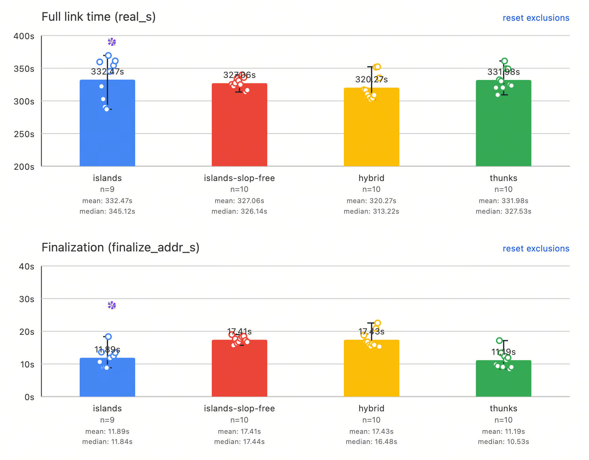
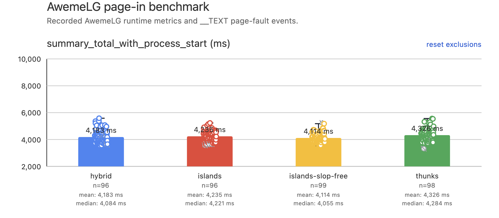
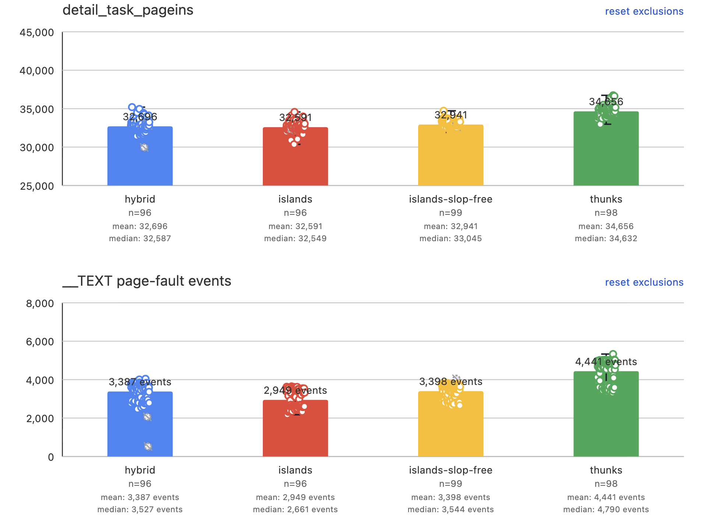
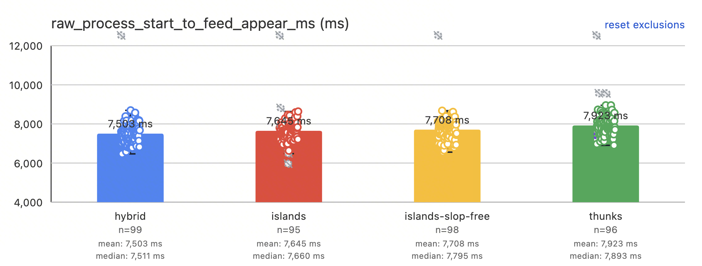
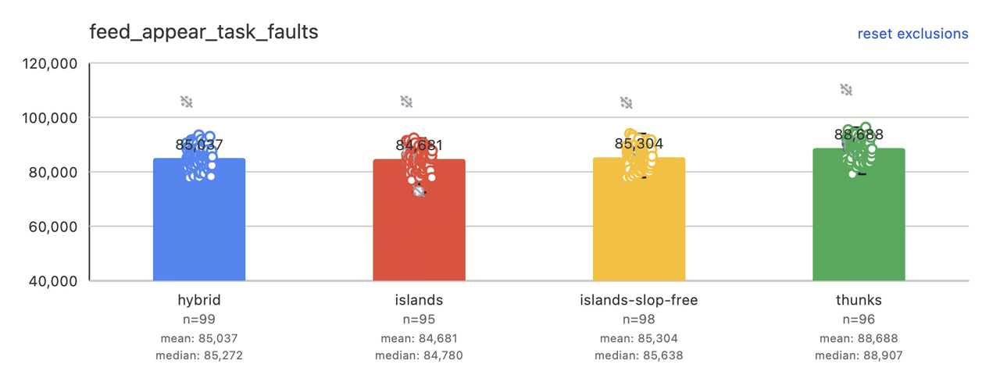
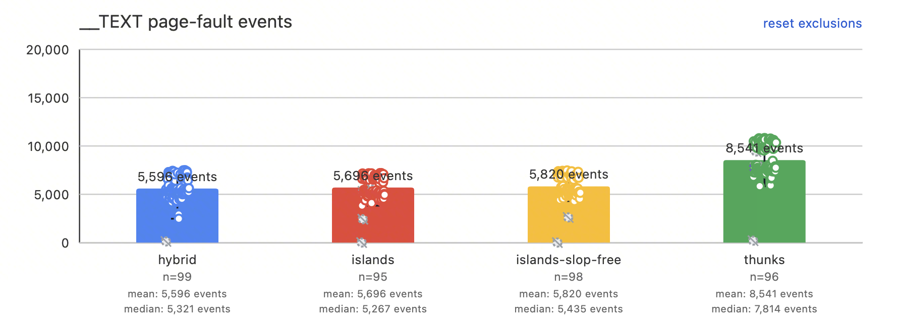
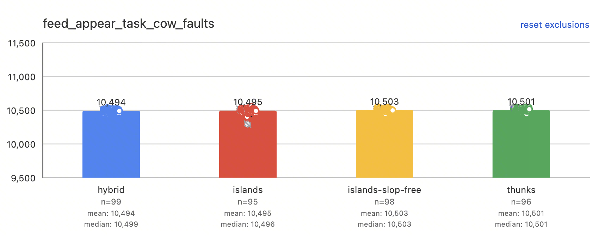

# RFC: Exact-Layout Branch Range Extension

## Summary

ARM64 direct branches have limited reach. When a destination is out of range in
the final linked image, lld redirects the branch through a
[range extender](#term-extender): either a 4-byte [island](#term-island) or a
12-byte [thunk](#term-thunk). For background, see @MaskRay's blog
[Long branches in compilers, assemblers, and linkers](https://maskray.me/blog/2026-01-25-long-branches-in-compilers-assemblers-and-linkers).

This RFC adds opt-in extension modes; the default
`--branch-range-extension=thunks` path is unchanged.

**Slop-free.** The existing one-pass finalizer reserves fixed *slop* for extenders
that may be inserted later, artificially reducing every branch's usable range.
The new algorithm replaces this slop with runtime reservations based on actual
extender demand, then rebuilds and validates the graph against its exact layout.

**Hybrid.** Extenders combine cheap islands with thunks.
`islands-slop-free` permits an unlimited island chain, while `hybrid` limits a
chain to two islands and uses thunks for the remaining calls.

## 1. Algorithm

### 1.1 Exact-layout iteration

The existing Mach-O thunk algorithm finalizes once and protects that decision
with fixed slop. This is simple but contracts every branch range before actual
extender demand is known. ELF lld instead iterates by changing real output
layout until its thunks stabilize.

This design keeps iteration separate from committed output. A reservation
layout replaces global slop with extender demand observed at each boundary,
giving the planner a more realistic estimate without contracting every branch
range. An exact layout then removes unused reservation and contains only the
live extenders. A rejected graph is rebuilt; only a self-validating graph is
materialized.

Extenders change later layout, so finalization uses multiple passes. Each pass:

1. Builds a fresh extender graph and callsite routes.
2. Calculates the exact layout containing only the live planned extenders.
3. Validates every `BRANCH26` edge against that layout.

A failing layout teaches the next pass two facts: how many extender bytes each
boundary must reserve, and which direct calls must instead use an extender.
Both facts are monotonic across passes.

Iteration stops after 30 passes if no exact layout validates.

### 1.2 Driver

In schematic form (reservation growth and call promotion are inline loops in
`Finalizer::run`):

```cpp
collect();

for (pass = 1; pass <= 30; ++pass) {
  plan();       // reservation layout, then a fresh extender graph
  layout(true); // exact layout containing live extenders only
  if (validate())
    break;

  if (growBoundaryReservations())
    continue;
  forceInvalidDirectCalls();
}
if (pass > 30)
  fail();

materialize();
rewriteBranchesAndCollectStats();
layout(true, /*emit=*/true);
```

## 2. Benchmark results

`thunks` is the existing lld mode. `islands` is the downstream implementation
of ld64-style islands with a fixed reserved island region. The two new modes
replace that fixed reservation with exact-layout iteration. *Contribution* is
the total emitted extender code: 4 bytes per island and 12 bytes per thunk.

| Mode | `x16` clobber | Slop-free | AwemeLGCore contribution | TikTokCore contribution |
|---|:---:|:---:|---:|---:|
| `thunks` | yes | no | 3.68 MiB | 6.82 MiB |
| `islands` | no | no | 1.83 MiB | 4.16 MiB |
| `islands-slop-free` | no | yes | 1.76 MiB | 3.32 MiB |
| `hybrid` | on fallback | yes | 1.76 MiB | 3.67 MiB |

The extender counts behind those contributions are:

| Mode | AwemeLGCore thunks | AwemeLGCore islands | TikTokCore thunks | TikTokCore islands |
|---|---:|---:|---:|---:|
| `thunks` | 321,574 | 0 | 596,310 | 0 |
| `islands` | 0 | 478,439 | 0 | 1,089,665 |
| `islands-slop-free` | 0 | 461,523 | 0 | 869,543 |
| `hybrid` | 0 | 461,523 | 59,371 | 783,688 |

AwemeLGCore has a 360 MiB `__text`; two island hops cover its call distances,
so `hybrid` and `islands-slop-free` produce exactly the same layout. TikTokCore
has a 420 MiB `__text`; calls beyond two island hops account for hybrid's thunk
tail.

### Linking Performance
TikTokCore:


### Runtime Performance
AwemeLGCore:

Launching Time:

Page-in Events:


TikTokCore:

Launching Time:

Page-in Events:




## 3. Current design

### 3.1 Data model

The implementation uses one in-place pointer graph rather than separate
context, proposal, and layout objects:

| Structure | Main state |
|---|---|
| `Boundary` | input section, cross-pass `reserved`, per-pass `planned`, derived VA |
| `Callee` | symbol, addend, cached local-target input/value, sorted callsites |
| `Callsite` | relocation, input index, monotonic `forceExtender`, selected extender pointer |
| `Extender` | callee pointer, boundary index, island/thunk kind, liveness, VA, materialized section and symbol |

`Finalizer` owns the output-section run, flattened boundaries, callees, current
extenders, later-section estimate cache, text end, and boundary-probe count.
`ExtensionStats` is populated only after validation and does not participate in
planning.

Only `Boundary::reserved` and `Callsite::forceExtender` survive a rejected pass.
`Boundary::planned`, callsite routes, and extenders are rebuilt by `plan()`.

### 3.2 Exactness contract

The exact calculation must reproduce the emitted text layout byte for byte: all
owner and input alignment, all input sizes, extender alignment, and every live
extender size must be included, while unused reservation must be excluded. The
final emit runs the same calculation and asserts that finalization agrees with
it. Calculation details are left to the implementation.

### 3.3 Callee-centric planning

Calls are grouped by effective callee and kept in address order. For a resolved
callee, planning splits calls around the target and plans both sides from the
farthest call inward. Each side creates one shared island chain; the callee owns
one thunk set reused across both sides. Nearer calls reuse those extenders
instead of repeating placement searches.

This changes the number of independent extender-planning groups from one per
callsite to at most two per callee: O(callees) rather than O(callsites). Each
group creates a shared island chain and contributes to the callee's shared thunk
set for calls on both sides. Call assignment and validation remain linear in
callsites, but removing repeated placement searches substantially reduces the
dominant planning time on large links.

## Appendix A: Terminology

<a id="term-extender"></a>

### Extender

An *extender* is linker-generated code that gives an out-of-range branch a
reachable intermediate destination. In this RFC, an extender is either an
island or a thunk.

<a id="term-island"></a>

### Island

An *island* is a 4-byte ARM64 direct branch inserted between a callsite and its
destination. Its outgoing edge is also range-limited, so islands may be
chained: a terminal island branches to the original destination, while a relay
island branches to another island closer to that destination.

<a id="term-thunk"></a>

### Thunk

A *thunk* is a 12-byte `adrp; add; br x16` sequence inserted within
direct-branch range of a callsite. Its branch to the original destination does
not use a range-limited `BRANCH26` relocation, so a thunk does not need an
island chain. It clobbers `x16`.

## Appendix B: Implementation reference

### B.1 Collection

Collection flattens the contiguous run of code inputs into `Boundary` order and
groups branch relocations by effective destination. A local, non-binding
`Defined` is keyed by `(input section, value + addend)` so aliases share one
callee; other targets use `(symbol, addend)`. Callsites are stored in address
order. Local target coordinates are cached in the callee.

### B.2 Planning and layout

`plan()` clears the old graph, resets per-boundary planned bytes and callsite
routes, and calculates the reservation layout. The reservation at each boundary
is the largest live extender demand observed there, keeping provisional
placement close to the exact layout and reducing repeated placement changes.
Unresolved non-DTrace targets use thunks in hybrid mode and fail in islands-only
mode.

For a resolved callee, each address side grows a chain from the target toward
the farthest call needing extension. Hybrid stops after two islands;
islands-only continues while legal boundaries exist. Each call selects its
nearest reachable island. Hybrid falls back to a callee-scoped thunk, probing
candidate boundaries outward from the callsite. Unused islands are removed and
live extenders are stable-sorted by boundary before exact layout.

Creating an extender immediately increases `Boundary::planned`, so later
extenders at the same boundary get distinct provisional positions. After exact
layout, `forEachIslandEdge` sweeps boundary-sorted extenders in both directions
and reconstructs the next inward island per callee.

### B.3 Validation and learning

Every island must reach its next inward island or callee, every routed call must
reach its extender, and every remaining direct call must reach its callee.
Unresolved direct calls are accepted only for DTrace, and forced calls may not
remain direct.

After failure, reservations first grow to live planned bytes. Only when no
reservation grows are exact-layout direct failures marked `forceExtender`.
Planning then clears and rebuilds the rejected graph.

### B.4 Commit

Materialization creates islands from the target outward so each relay can refer
to an existing inward symbol, then creates thunks. Rewriting keeps a call direct
when the accepted exact layout permits it; otherwise it retargets the relocation
to the selected extender and clears the addend.

The final emit uses `layout(true, true)`. Verbose statistics report passes,
branch relocations, island/chain/thunk calls, island and thunk counts, verified
`BRANCH26` edges, boundary probes, and total extenders.
