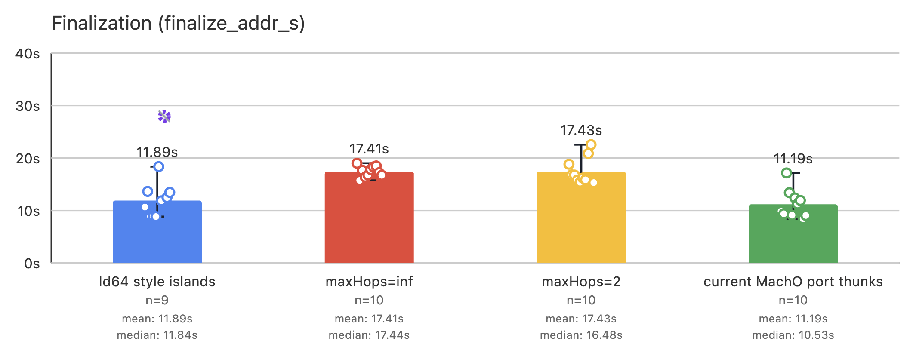
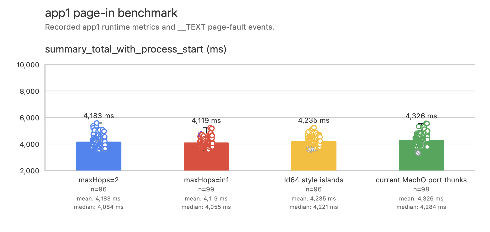
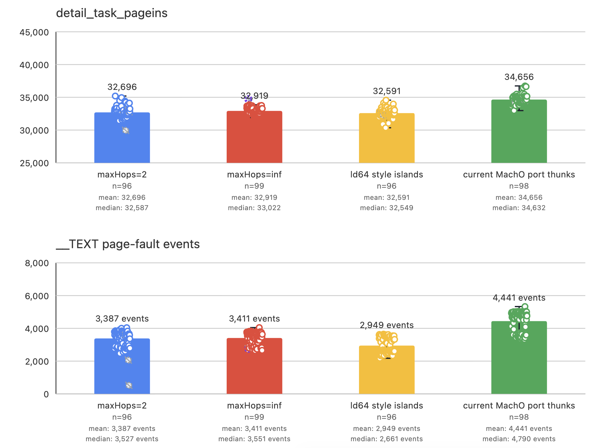
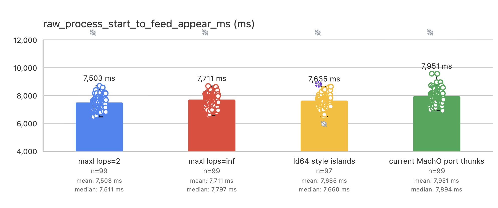
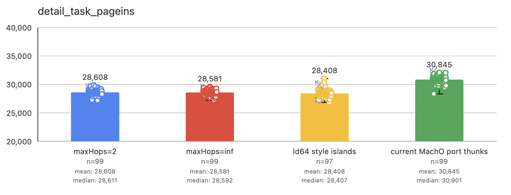
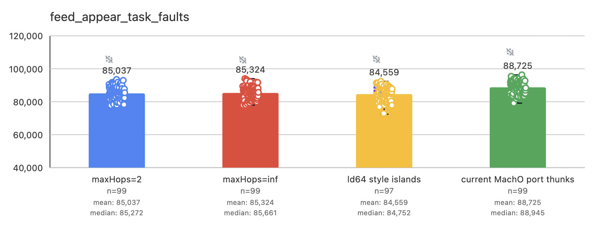
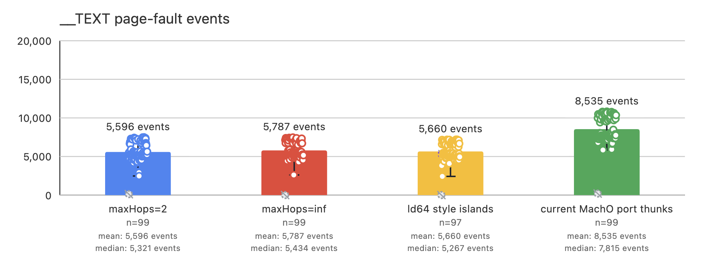
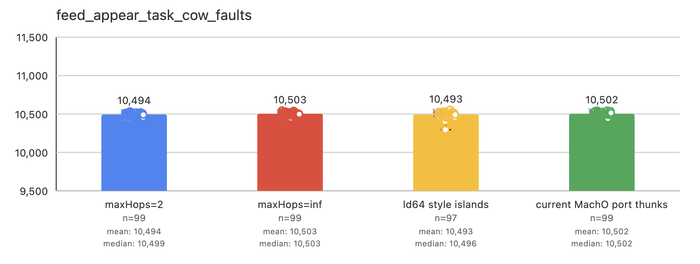

# [LLD, Mach-O] RFC: A Flexible Multipass Algorithm for Branch-Range Extension

## Summary

This RFC proposes a flexible, multipass algorithm for resolving out-of-range
ARM64 branches in LLD's Mach-O port. The algorithm eliminates fixed slop
reservations. It uses compact 4-byte islands for most out-of-range branches and
12-byte thunks for branches that require greater reach. The `maxHops` parameter
controls the trade-off between the two. It is exposed as
`--branch-range-extension-max-hops=<N>` and defaults to `2`. Thunk fallback
remains available when the hop budget is exhausted or an island route cannot
be formed.

## Motivation

LLD's Mach-O port currently uses a single-pass finalizer that resolves every
out-of-range branch with a 12-byte thunk. These thunks can reach any target in
a `__TEXT` segment smaller than 4 GiB, which is sufficient in most cases. The
finalizer pessimistically reserves slop to keep every call-to-thunk branch in
range as later insertions shift the layout. This reservation reduces the usable
branch range. If it is insufficient, users must work around thunk-range
overruns by tuning `--slop_scale`. This need for manual tuning results in a
poor user experience.

Although thunks generally provide sufficient reach, islands offer two key
advantages: they preserve the `x16` register and use less space when the
`__TEXT` segment is smaller than roughly 384 MiB. Two island hops are generally
enough to cover branches in binaries of this size. We therefore propose a
slop-free hybrid that favors islands and falls back to thunks after a
configurable number of hops.

## Results

We evaluated two production binaries: App1, with a 456.05 MiB `__TEXT` segment,
and App2, with a 449.16 MiB `__TEXT` segment. We linked each binary using four
configurations: the current Mach-O thunk strategy, ld64-style islands, and the
proposed algorithm with `maxHops=inf` and `maxHops=2`. *Contribution* is the
total size of the emitted extender code: 4 bytes per island and 12 bytes per
thunk.

| Configuration | `x16` clobber | Slop-free | App1 contribution | App2 contribution |
|---|:---:|:---:|---:|---:|
| `current Mach-O thunks` | yes | no | 3.68 MiB | 6.82 MiB |
| `ld64-style islands` | no | no | 1.83 MiB | 4.16 MiB |
| `maxHops=inf` | no | yes | 1.76 MiB | 3.32 MiB |
| `maxHops=2` | on fallback | yes | 1.76 MiB | 3.67 MiB |

The corresponding extender counts are:

| Configuration | App1 thunks | App1 islands | App2 thunks | App2 islands |
|---|---:|---:|---:|---:|
| `current Mach-O thunks` | 321,574 | 0 | 596,310 | 0 |
| `ld64-style islands` | 0 | 478,439 | 0 | 1,089,665 |
| `maxHops=inf` | 0 | 461,523 | 0 | 869,543 |
| `maxHops=2` | 0 | 461,523 | 59,371 | 783,688 |

Two island hops cover all call distances in App1, so `maxHops=2` and
`maxHops=inf` produce the same layout. App2 contains calls that require more
than two island hops; with `maxHops=2`, those calls use thunks instead.

### Liking performance

### Runtime performance

App1 launch time:

App1 page-in events:

App2 launch time:

App2 page-in events:

App2 task faults:

App2 text page-fault events:

App2 copy-on-write faults:

## Proposed algorithm

The proposed finalizer is a slop-free hybrid that uses compact islands where
possible and falls back to thunks when greater reach is required. It eliminates
fixed slop by learning how much extender space is required at each insertion
boundary. An ELF-style multipass algorithm builds shared island and thunk
routes for callsites that have the same callee.

The previous single-pass finalizer had to reserve slop before the actual thunk
demand was known. This reservation reduced the usable branch range but could
still be insufficient. The new finalizer starts with no reserved space. If a
proposal fails validation, the finalizer increases the reservation only at the
boundaries where the proposal needed more space. The next pass then plans
against the updated reservation layout. Once a proposal validates, its live
extenders replace the reservations, and unused reserved space is not emitted.
Thus, reservations are learned from actual failures instead of being set by a
global estimate or `--slop_scale`.

The multipass design is necessary because inserting an extender shifts later
addresses and may invalidate branches that were previously in range. Each pass
therefore builds a proposal, computes its exact layout, and validates every
direct and extended branch edge. The proposed default, `maxHops=2`, allows the
hybrid to use up to two 4-byte island hops before falling back to a 12-byte
thunk. Two islands use less code than one thunk while keeping the expected
number of additional page-ins below two.

Unlike ELF, which iterates over the `ThunkSection`s inserted by earlier passes,
this algorithm iterates over reserved space. Each pass freezes one reservation
layout and plans every callee against it. If the proposal is rejected, all
placement choices are discarded; only the required space at each boundary is
retained. As a result, every planner in a pass uses the same stable coordinate
system, failed placement choices do not constrain later passes, and extender
sharing can be reconsidered on each pass. Reservations and forced-call state
only grow, so each rejection makes monotonic progress toward convergence.

Planning is organized by callee so that callsites with the same effective
target can share extenders. Once the reservation layout fixes the callee and
callsite addresses, the farthest callsite on each side of the callee determines
the region to cover. The planner builds an island chain outward from the
callee, routes nearer callsites through reachable islands, and reuses an
in-range thunk when a fallback is needed. It then removes any unused
candidates. This coverage-driven approach avoids duplicate extenders and makes
the result independent of callsite visitation order.

The algorithms also differ in how they place an in-range extender:

| Algorithm | Placement |
|---|---|
| Previous Mach-O finalizer | Places a thunk near the forward edge of a waiting callsite's range and protects the placement with fixed slop |
| ld64-style islands | Packs islands into a fixed reserved region rather than choosing a position from the caller and callee |
| ELF | Prefers an existing, pre-spaced `ThunkSection` in range; otherwise places one beside the callsite |
| Proposed finalizer | Places an island as far toward the most distant callsite as the hop back toward the callee permits; reuses an in-range thunk or places one at the legal boundary nearest an uncovered callsite |

These choices reflect each algorithm's planning unit. The previous Mach-O
finalizer scans callsites in layout order, so it places an active thunk near the
forward limit of the branch range. This increases reuse by later callsites at
the cost of fixed slop. ELF uses pre-spaced containers to serve many callers
and adds a caller-local container only when no existing container is reachable.

The proposed finalizer instead optimizes coverage for one callee at a time. It
places each island outward from the callee to maximize the additional callsite
range covered by that hop. To distribute chains, the planner first considers
insertion boundaries spaced approximately 1 MiB apart, then falls back to any
exact input boundary. Because a thunk can reach its callee indirectly from
anywhere, the planner places a new thunk at the legal boundary nearest the
callsite, maximizing the branch's range margin.
